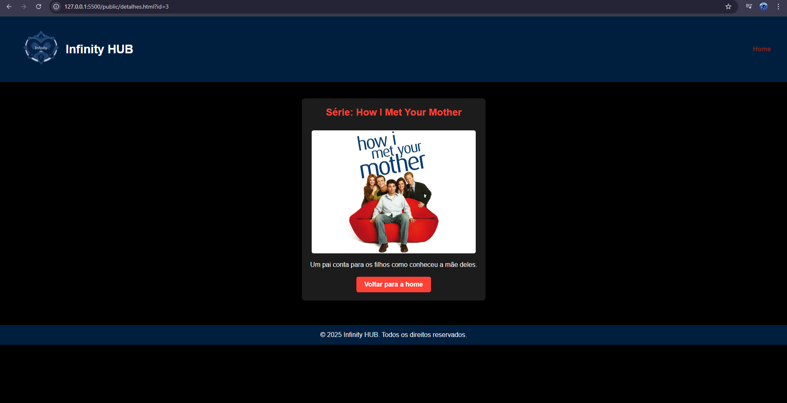

# Trabalho Prático 05 - Semanas 7 e 8

**Páginas de detalhes dinâmicas**

Nessa etapa, vamos evoluir o trabalho anterior, acrescentando a página de detalhes, conforme o  projeto escolhido. Imagine que a página principal (home-page) mostre um visão dos vários itens que existem no seu site. Ao clicar em um item, você é direcionado pra a página de detalhes. A página de detalhe vai mostrar todas as informações sobre o item do seu projeto. seja esse item uma notícia, filme, receita, lugar turístico ou evento.

Leia o enunciado completo no Canvas. 

**IMPORTANTE:** Assim como informado anteriormente, capriche na etapa pois você vai precisar dessa parte para as próximas semanas. 

**IMPORTANTE:** Você deve trabalhar e alterar apenas arquivos dentro da pasta **`public`,** mantendo os arquivos **`index.html`**, **`styles.css`** e **`app.js`** com estes nomes, conforme enunciado. Deixe todos os demais arquivos e pastas desse repositório inalterados. **PRESTE MUITA ATENÇÃO NISSO.**

## Informações Gerais

- Nome: Evelyn de Paula Costa
- Matricula: 904838
- Proposta de projeto escolhida: Site que faz recomendação de filmes, séries, livros e jogos.
- Breve descrição sobre seu projeto:  Com esse site, quando o usuário selecionar um gênero de seu interesse, aparecerá a recomendação de um filme, um livro, uma série e um jogo que combinam com o gênero escolhido.

## Print da Home-Page


## Print da página de detalhes do item



## Cole aqui abaixo a estrutura JSON utilizada no app.js
const destaques = [
    {
        tipo: "Jogo",
        titulo: "The Last of Us Part II",
        descricao: "Explore um mundo pós-apocalíptico cheio de desafios e emoções",
        imagem: "img/tlou2.jpeg"
    },
    {
        tipo: "Filme",
        titulo: "Inception",
        descricao: "Uma jornada através dos sonhos que desafia a realidade.",
        imagem: "img/inception.jpg"
    },
    {
        tipo: "Livro",
        titulo: "1984 de George Orwell",
        descricao: "Uma distopia clássica que explora temas de vigilância e liberdade.",
        imagem: "img/1984.jpg"
    },
    {
        tipo: "Série",
        titulo: "How I Met Your Mother",
        descricao: "Um pai conta para os filhos como conheceu a mãe deles.",
        imagem: "img/himym.jpg"
    }
]


```javascript
const dados = [
  {
    "id": 1,
    "titulo": "Prefeitura Lança Plano de Mobilidade Urbana",
    "descricao": "Novo plano do transporte público.",
    "conteudo": "A Prefeitura apresentou nesta segunda-feira um novo plano de mobilidade urbana.",
    "categoria": "Cidades",
    "autor": "Joana Ribeiro",
    "data": "2025-03-30",
    "imagem": "img/mobilidade.jpg"
  }
]
```